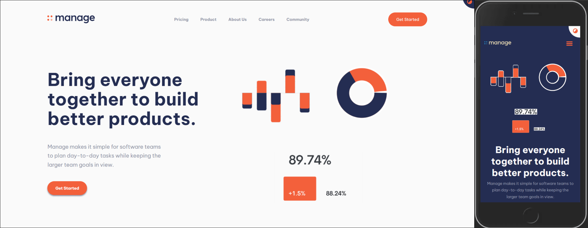

# Frontend Mentor - Manage landing page solution

This is a solution to the [Manage landing page challenge on Frontend Mentor](https://www.frontendmentor.io/challenges/manage-landing-page-SLXqC6P5). Frontend Mentor challenges help you improve your coding skills by building realistic projects. 

## Table of contents

- [Overview](#overview)
  - [The challenge](#the-challenge)
  - [Screenshot](#screenshot)
  - [Links](#links)
- [My process](#my-process)
  - [Built with](#built-with)
  - [What I learned](#what-i-learned)
  - [Useful resources](#useful-resources)
- [Author](#author)
- [Acknowledgments](#acknowledgments)

## Overview

### The challenge

Users should be able to:

- View the optimal layout for the site depending on their device's screen size
- See hover states for all interactive elements on the page
- See all testimonials in a horizontal slider
- Receive an error message when the newsletter sign up `form` is submitted if:
  - The `input` field is empty
  - The email address is not formatted correctly

### Screenshot

### Links

- Solution URL: [CODE](https://github.com/SinisaVukmirovic/FrontEnd-Mentor-challenge-8)
- Live Site URL: [DEMO](https://front-end-mentor-challenge-8.vercel.app/)

## My process

### Built with

- ASTRO SSG
- Astro View Transitions

### What I learned

Had so many problems with implementing this type of theme switch functionality into a multipage project like this. Learned that this type of theme switch is suited only for some small langing page projects, for example, not a multipage project...
Had to ommit slider in testimonials section to have it "working"...
Changing pages breaks the functionality of theme switching...

## Author

- Website - [Sinisa Vukmirovic](https://github.com/SinisaVukmirovic)
- Frontend Mentor - [@SinisaVukmirovic](https://www.frontendmentor.io/profile/SinisaVukmirovic)
- Twitter - [@sajtowski](https://twitter.com/sajtowski)